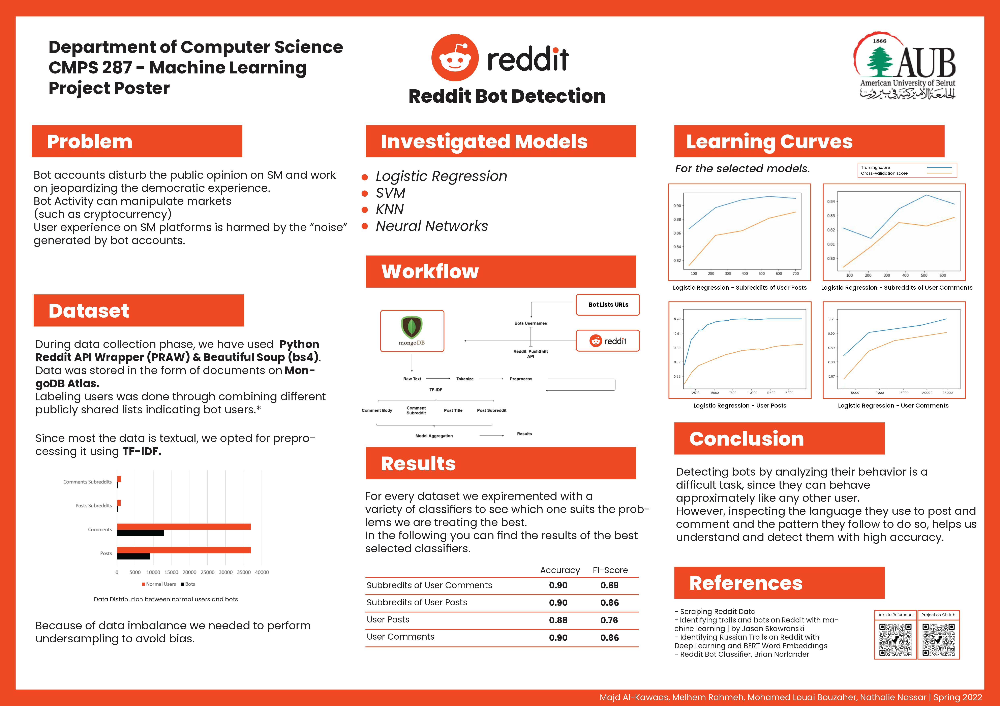

# reddit_bot_detection

## Abstract:
Bot accounts have been a significant problem for social media websites especially Twitter and Reddit, most bots are harmful and they seek to create chaos or generate useless content on popular channels of social media communication. Our solution is a set of different machine learning models that performs Reddit bot detection on different sets of data about the users. We have chosen this approach to boost the accuracy of the results.

We have chosen comment/post level detection because account-level approaches require increased amounts of user data and there is a scarcity of officially verified bot accounts, whereas comments and posts can be analyzed using Natural Language Processing techniques.

## Project Poster:

